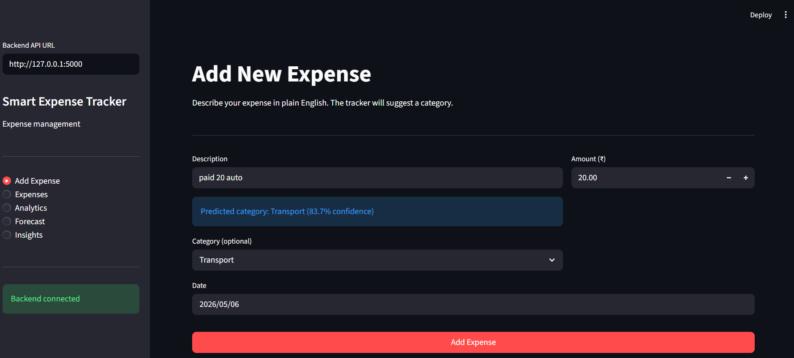
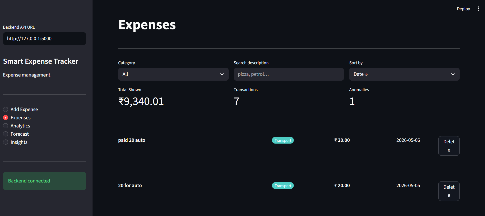

# Smart Expense Tracker

A lightweight, self-contained expense tracking application with a Flask REST API,
a static frontend (HTML/CSS/JS), and a small machine-learning pipeline for
automatic category prediction, anomaly detection, and simple forecasting.
This README serves as the canonical, final documentation for running and
distributing the project.

---

## Overview

- Server: Flask REST API implemented in `app.py`.
- Storage: SQLite database managed by `database.py` (auto-initializes `database.db`).
- ML: training and inference implemented in `train_model.py` and `ml_model.py`.
- Frontend: static HTML/CSS/JS inside the `Frontend/` folder (uses Chart.js).
- Manual category learning: if you choose a category manually for a description, the app saves that mapping and later reuses it for the same description or similar keyword variations.
- Dependencies: listed in `requirements.txt`.

---

## Quick Start (local)

1. Create and activate a virtual environment (recommended):

```powershell
python -m venv .venv
.\.venv\Scripts\Activate.ps1
```

2. Install dependencies:

```bash
pip install -r requirements.txt
```

3. (Optional) Train the ML model to generate `model.pkl`:

```bash
python train_model.py
```

4. Start the API server:

```bash
python app.py
```

5. Open or serve the frontend:

- Open `Frontend/index (2).html` directly in the browser.
- Or serve the folder to avoid file/CORS limitations:

```bash
cd Frontend
python -m http.server 8000
# then open http://127.0.0.1:8000/index%20(2).html
```

The frontend expects the API at `http://127.0.0.1:5000` by default.

---

## Repository layout

```
.
├── app.py
├── database.py
├── ml_model.py
├── train_model.py
├── model.pkl          # Generated after training (joblib bundle) — optional
├── requirements.txt
├── Frontend/          # Static UI (HTML/CSS/JS)
│   ├── index (2).html
│   ├── script.js
│   └── style.css
└── images/            # Place screenshots here (referenced in README)
```

---

## API (summary)

Primary endpoints implemented in `app.py`:

- `GET /api/health` — health check
- `POST /api/expenses` — add expense (JSON: `description`, `amount`, `date`, optional `category`)
- `GET /api/expenses` — list expenses
- `DELETE /api/expenses/<id>` — delete expense
- `POST /api/predict` — predict category (JSON: `description`)
- `GET /api/analytics` — totals, category breakdown, anomaly count
- `GET /api/forecast` — next-month spending prediction
- `GET /api/insights` — human-readable insights
- Budget endpoints: `POST /api/budgets`, `GET /api/budgets`, `DELETE /api/budgets/<category>/<period>`, `GET /api/budget-report`

See `app.py` for full parameter/response details and examples.

---

## Notes & recommendations

- ML model: TF-IDF vectorizer + RandomForest. Improve accuracy by adding labeled
  examples to `train_model.py` and re-training.
- Manual category mappings are now persisted automatically. If you manually choose a category for a description, the same description and closely related keyword variations will return that saved category on future predictions.
- `model.pkl` is optional. When absent, category predictions fall back to
  `Uncategorized` (the API remains usable for recording expenses and budgets).
- CORS is enabled in `app.py` so the static frontend can call the API.

---

## Images / Screenshots

Place screenshots in the `images/` folder. Recommended filenames (used below):

- `image_1.png`
- `images.png`

Embedding examples for this README:

```


```

If you add screenshots with the filenames above they will render automatically.

---

## Next steps I can help with

- Add example API requests/responses and curl snippets.
- Create a small `setup.ps1` script to automate environment creation and launching.
- Add a CONTRIBUTING or CHANGELOG section.

Tell me which you'd like and I'll implement it.
